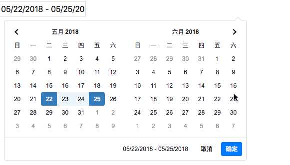

# Angular date-range-picker

## demo


## install
### add css file
```css
<link rel="stylesheet" href="https://stackpath.bootstrapcdn.com/bootstrap/4.1.1/css/bootstrap.min.css" integrity="sha384-WskhaSGFgHYWDcbwN70/dfYBj47jz9qbsMId/iRN3ewGhXQFZCSftd1LZCfmhktB" crossorigin="anonymous">
<link rel="stylesheet" type="text/css" href="https://cdn.jsdelivr.net/npm/daterangepicker/daterangepicker.css" />
```

### npm install
npm install --save ngx-input-date-range-picker

## use
```js
import NgxInputDateRangeModule from './modules/ngx-input-date-range/ngx-input-date-range.module';
@NgModule({
  declarations: [
    AppComponent
  ],
  imports: [
    BrowserModule,
    CommonModule,
    NgxInputDateRangeModule
  ],
  providers: [],
  bootstrap: [AppComponent]
})
export class AppModule { }
```
